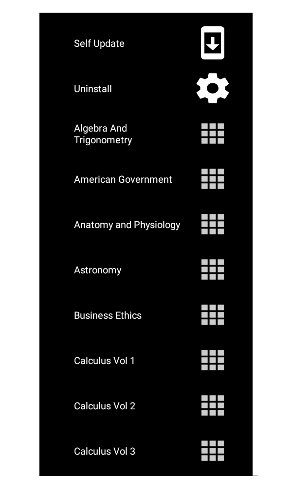

<h1>
An Unofficial bash downloader for <a href="https://openstax.org/about" target="_blank">OpenStax</a> books
</h1>

Openstax "publishes high-quality, peer-reviewed, openly licensed college textbooks that are absolutely free online and low cost in print"

The purpose of this script is a direct downloader for a majority of the books for a Linux CLI environment.

```
/bin/bash -c "$(curl -fsSL https://raw.githubusercontent.com/Risingfeanyx/openstax_cli/master/main.sh)" 
```


<h2>
<a href="https://www.icloud.com/shortcuts/9b6d584ff02d41768726429a8ed1e1bb">iOS Shortcuts version</a>
</h2>
<a href="https://support.apple.com/en-us/HT208309">Requires iOS 12</a> and the <a href="https://apps.apple.com/us/app/shortcuts/id915249334">iOS Shortcuts app</a>

You'll want to enable <a href="https://support.apple.com/en-us/HT210628">Untrusted Shortcuts</a> in order to use this
  


<h2>
Tasker based <a href="https://github.com/Risingfeanyx/Openstax-Browser/blob/master/OpenStax_Downloader.apk" target="_blank">APK</a> finished,
</h2>
Going to give it some prettier icons soon ™


