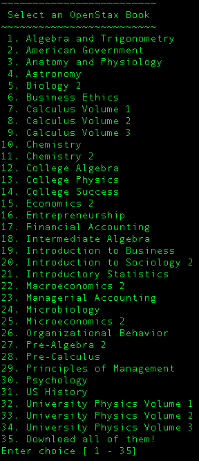

<h1>
An Unofficial bash downloader for <a href="https://openstax.org/about" target="_blank">OpenStax</a> books
</h1>

Openstax "publish high-quality, peer-reviewed, openly licensed college textbooks that are absolutely free online and low cost in print"

The purpose of this script is a direct downloader for a majority of the books for a Linux CLI environment.

```
/bin/bash -c "$(curl -fsSL https://raw.githubusercontent.com/Risingfeanyx/openstax_cli/master/main.sh)" 
```



<a href="https://www.icloud.com/shortcuts/9b6d584ff02d41768726429a8ed1e1bb">iOS Shortcuts version</a>

<a href="https://support.apple.com/en-us/HT208309">Requires iOS 12</a> and the <a href="https://apps.apple.com/us/app/shortcuts/id915249334">iOS Shortcuts app</a>

<a href="https://support.apple.com/en-us/HT210628">Untrusted Shortcuts</a>

You'll want to enable  in order to use homebrew shortcuts
